# H1

------

### 实验环境

1. Ubuntu 20.04.02 Server 64bit
2. 阿里云云上实践平台

------

### 实验问题

- 调查调查并记录实验环境的如下信息：
  - 当前 Linux 发行版基本信息
  - 当前 Linux 内核版本信息

- Virtualbox 安装完 Ubuntu 之后新添加的网卡如何实现系统开机自动启用和自动获取 IP？
- 如何使用 `scp` 在「虚拟机和宿主机之间」、「本机和远程 Linux 系统之间」传输文件？
- 如何配置 SSH 免密登录？

------

### 实验过程

#### 1.查询当前 Linux 发行版基本信息

```
lsb_release -a
```

- 本地虚拟机

  

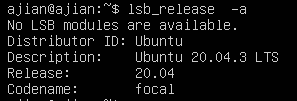

- 阿里云平台

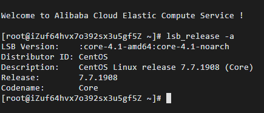

#### 2.查询当前 Linux 内核版本信息

```
uname -srm
```

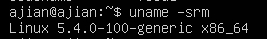

uname命令显示多个系统信息，包括Linux内核体系结构，名称版本和发行版。

或是：

```
hostnamectl
```

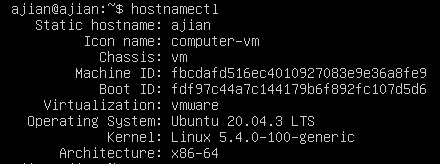

hostnamectl实用程序是systemd的一部分，用于查询和更改系统主机名。 它还显示Linux发行版和内核版本。

#### 3.Virtualbox 安装完 Ubuntu 之后新添加的网卡如何实现系统开机自动启用和自动获取 IP？

查看所有网卡

```
ifconfig -a
```

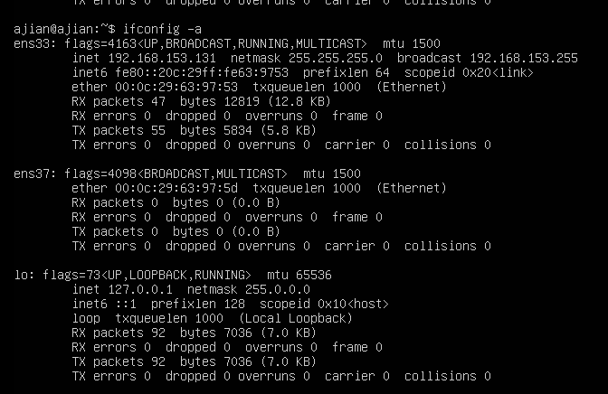

当前工作网卡

```
ifconfig
```

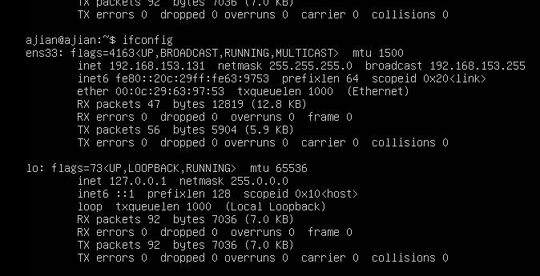

如果为ubuntu新添加了网卡，那么通过命令`ifconfig -a`可以看到所有网卡，但是可能有网卡没有工作，这个情况下使用`ifconfig`就会看到出现网卡比使用参数`-a`少，那没有出现的网卡就是没有生效。

修改配置文件


```
sudo netplan apply
```

生效！

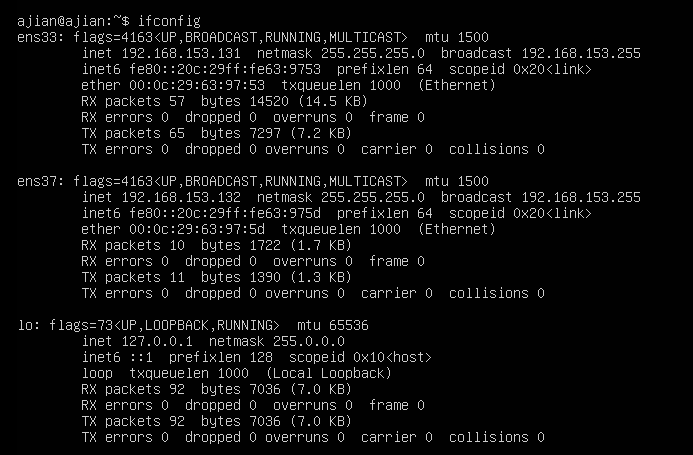

#### 4.如何使用 `scp` 在「虚拟机和宿主机之间」、「本机和远程 Linux 系统之间」传输文件？

- ##### 「虚拟机和宿主机之间」

  scp命令格式：

  ```
  scp local_file remote_username@remote_ip:remote_folder 
  或者 
  scp local_file remote_username@remote_ip:remote_file 
  或者 
  scp local_file remote_ip:remote_folder 
  或者 
  scp local_file remote_ip:remote_file 
  ```

  查询虚拟机ip

  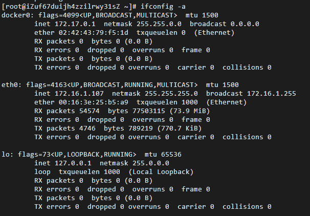

  将宿主机的test文件传输到虚拟机

  ```
  C:\Users\A_jian>scp Desktop\test.txt ajian@192.xxx.xxx.xxx:test_folder
  ```

  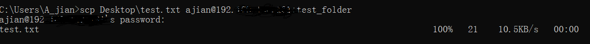

- ##### 「本机和远程 Linux 系统之间」

  查看ip地址

  ```
  ifconfig -a
  ```

  

  传文件

  ```
  scp test_folder root@101.133.133.91:remote_folder
  ```

  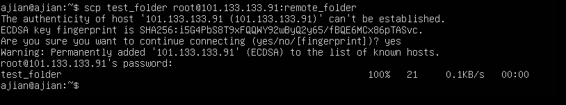

  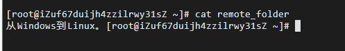


#### 5.如何配置 SSH 免密登录？

- 本地客户端生成公私钥

  ```
  ssh-keygen
  ```

- 上传公钥到需要免密登录的服务端

  ```
  ssh-copy-id -i ssh_key.pub root@101.133.160.228
  ```

- 免密登录

  ```
  ssh root@101.133.160.228
  ```

  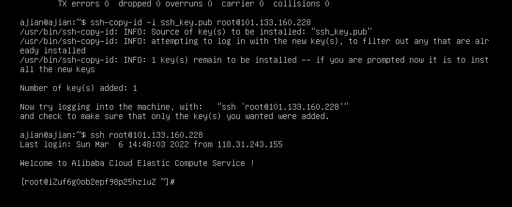


------

### 问题及解决方案

- ##### 无法退出vim编辑器

  参考[linux系统中如何进入退出vim编辑器，方法及区别](https://blog.csdn.net/u010142437/article/details/71172045)
  
- ##### 无法ssh到windows11

------

### 参考资料

- [查看Linux内核版本命令（两种方法）](https://www.cnblogs.com/ywl925/p/11083351.html)
- [ubuntu20添加新网卡后设置自动启用并获取ip]([(5条消息) ubuntu20添加新网卡后设置自动启用并获取ip_lalala-CSDN博客_ubuntu20启动网卡](https://blog.csdn.net/xiongyangg/article/details/110206220))
- [Linux scp命令](https://www.runoob.com/linux/linux-comm-scp.html)
- [SSH 三步解决免密登录](https://blog.csdn.net/jeikerxiao/article/details/84105529)

