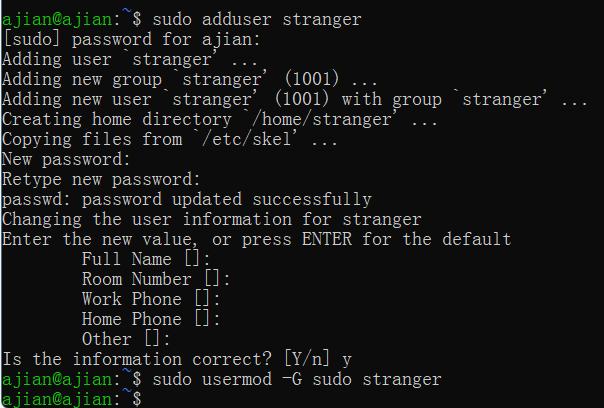
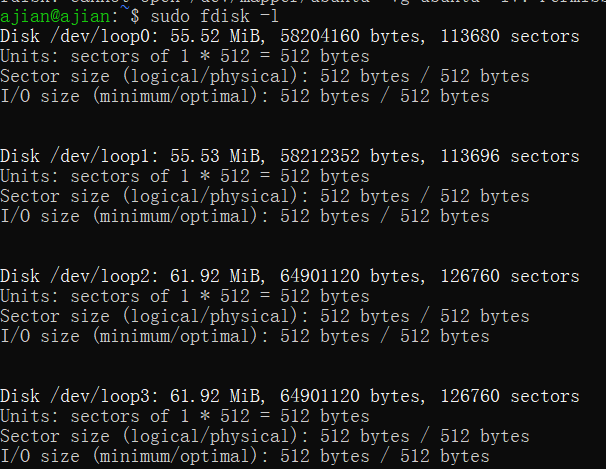
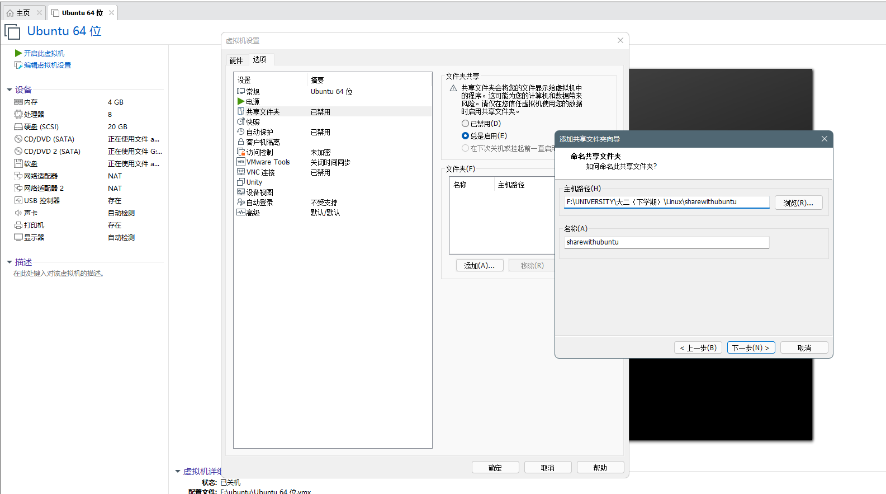
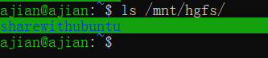

## H3

### 实验环境

Ubuntu20.04

### 实验问题

- Systemd入门教程实践
- 课后自查清单

### 实验过程

#### 1.Systemd入门教程实践

- systemctl

```bash
# 重启系统
$ sudo systemctl reboot
# 暂停系统
$ sudo systemctl suspend
```

- systemd-analyze

```bash
# 查看启动耗时
$ systemd-analyze                                                                                       
# 查看每个服务的启动耗时
$ systemd-analyze blame

# 显示瀑布状的启动过程流
$ systemd-analyze critical-chain

# 显示指定服务的启动流
$ systemd-analyze critical-chain atd.service
```

- hostnamectl

```bash
# 显示当前主机的信息
$ hostnamectl

# 设置主机名。
$ sudo hostnamectl set-hostname rhel7
```

- localectl

```bash
# 查看本地化设置
$ localectl

# 设置本地化参数。
$ sudo localectl set-locale LANG=en_GB.utf8
$ sudo localectl set-keymap en_GB
```

- timedatectl

```bash
# 查看当前时区设置
$ timedatectl

# 显示所有可用的时区
$ timedatectl list-timezones                                                                                 
# 设置当前时区
$ sudo timedatectl set-timezone America/New_York
$ sudo timedatectl set-time YYYY-MM-DD
$ sudo timedatectl set-time HH:MM:SS
```

- loginctl

```bash
# 列出当前session
$ loginctl list-sessions

# 列出当前登录用户
$ loginctl list-users

# 列出显示指定用户的信息
$ loginctl show-user ruanyf
```

[](https://asciinema.org/a/a8osUFZ4VxxF8P13dCSt1GaWH)

- systemctl list-units

```bash
# 列出正在运行的 Unit
$ systemctl list-units

# 列出所有Unit，包括没有找到配置文件的或者启动失败的
$ systemctl list-units --all

# 列出所有没有运行的 Unit
$ systemctl list-units --all --state=inactive

# 列出所有加载失败的 Unit
$ systemctl list-units --failed

# 列出所有正在运行的、类型为 service 的 Unit
$ systemctl list-units --type=service
```

- systemctl status

```bash
# 显示系统状态
$ systemctl status

# 显示单个 Unit 的状态
$ systemctl status bluetooth.service

# 显示远程主机的某个 Unit 的状态
$ systemctl -H root@rhel7.example.com status httpd.service

# 显示某个 Unit 是否正在运行
$ systemctl is-active application.service

# 显示某个 Unit 是否处于启动失败状态
$ systemctl is-failed application.service

# 显示某个 Unit 服务是否建立了启动链接
$ systemctl is-enabled application.service
```

- Unit管理

```bash
# 立即启动一个服务
$ sudo systemctl start apache.service

# 立即停止一个服务
$ sudo systemctl stop apache.service

# 重启一个服务
$ sudo systemctl restart apache.service

# 杀死一个服务的所有子进程
$ sudo systemctl kill apache.service

# 重新加载一个服务的配置文件
$ sudo systemctl reload apache.service

# 重载所有修改过的配置文件
$ sudo systemctl daemon-reload

# 显示某个 Unit 的所有底层参数
$ systemctl show httpd.service

# 显示某个 Unit 的指定属性的值
$ systemctl show -p CPUShares httpd.service

# 设置某个 Unit 的指定属性
$ sudo systemctl set-property httpd.service CPUShares=500

# 列出一个Unit的所有依赖
$ systemctl list-dependencies nginx.service
```

- 配置文件

```bash
# 列出所有配置文件
$ systemctl list-unit-files

# 列出指定类型的配置文件
$ systemctl list-unit-files --type=service

# 查看配置文件内容
$ systemctl cat atd.service
```

[](https://asciinema.org/a/O72l1vreJ9y1NLlJRWctC6Xz4)

- Target

```bash
# 查看当前系统的所有 Target
$ systemctl list-unit-files --type=target

# 查看一个 Target 包含的所有 Unit
$ systemctl list-dependencies multi-user.target

# 查看启动时的默认 Target
$ systemctl get-default

# 设置启动时的默认 Target
$ sudo systemctl set-default multi-user.target

# 切换 Target 时，默认不关闭前一个 Target 启动的进程，
# systemctl isolate 命令改变这种行为，
# 关闭前一个 Target 里面所有不属于后一个 Target 的进程
$ sudo systemctl isolate multi-user.targe
```

[](https://asciinema.org/a/G7HAdAKnDxQQcHwZSvxj7okDo)

- 日志管理

```bash
# 查看所有日志（默认情况下 ，只保存本次启动的日志）
$ sudo journalctl

# 查看内核日志（不显示应用日志）
$ sudo journalctl -k

# 查看系统本次启动的日志
$ sudo journalctl -b
$ sudo journalctl -b -0

# 查看上一次启动的日志（需更改设置）
$ sudo journalctl -b -1

# 查看指定时间的日志
$ sudo journalctl --since="2012-10-30 18:17:16"
$ sudo journalctl --since "20 min ago"
$ sudo journalctl --since yesterday
$ sudo journalctl --since "2015-01-10" --until "2015-01-11 03:00"
$ sudo journalctl --since 09:00 --until "1 hour ago"

# 显示尾部的最新10行日志
$ sudo journalctl -n

# 显示尾部指定行数的日志
$ sudo journalctl -n 20

# 实时滚动显示最新日志
$ sudo journalctl -f

# 查看指定服务的日志
$ sudo journalctl /usr/lib/systemd/systemd

# 查看指定进程的日志
$ sudo journalctl _PID=1

# 查看某个路径的脚本的日志
$ sudo journalctl /usr/bin/bash

# 查看指定用户的日志
$ sudo journalctl _UID=33 --since today

# 查看某个 Unit 的日志
$ sudo journalctl -u nginx.service
$ sudo journalctl -u nginx.service --since today

# 实时滚动显示某个 Unit 的最新日志
$ sudo journalctl -u nginx.service -f

# 合并显示多个 Unit 的日志
$ journalctl -u nginx.service -u php-fpm.service --since today

# 查看指定优先级（及其以上级别）的日志，共有8级
# 0: emerg
# 1: alert
# 2: crit
# 3: err
# 4: warning
# 5: notice
# 6: info
# 7: debug
$ sudo journalctl -p err -b

# 日志默认分页输出，--no-pager 改为正常的标准输出
$ sudo journalctl --no-pager

# 以 JSON 格式（单行）输出
$ sudo journalctl -b -u nginx.service -o json

# 以 JSON 格式（多行）输出，可读性更好
$ sudo journalctl -b -u nginx.serviceqq
 -o json-pretty

# 显示日志占据的硬盘空间
$ sudo journalctl --disk-usage

# 指定日志文件占据的最大空间
$ sudo journalctl --vacuum-size=1G

# 指定日志文件保存多久
$ sudo journalctl --vacuum-time=1years
```

[](https://asciinema.org/a/lGMR4iYqpxVLvzsmnqWueRAWt)

#### 2.Systemd实战操作

[](https://asciinema.org/a/p10b3ttzoIwFhd7AWbyTZHp6B)

#### 3.课后自查清单

- 如何添加一个用户并使其具备sudo执行程序的权限？

```bash
sudo adduser stranger

sudo usermod -G sudo stranger
```



- 如何将一个用户添加到一个用户组？

```bash
usermod -a -G <groupname> <username>
```

- 如何查看当前系统的分区表和文件系统详细信息？

```bash
sudo fdisk -l
```



- 如何实现开机自动挂载Virtualbox的共享目录分区？

(没有Virtualbox).......





- 基于LVM（逻辑分卷管理）的分区如何实现动态扩容和缩减容量？

```bash
lvextend -L +<容量> <目录>    #扩容
lvreduce -L -<容量> <目录>    #减容
```

- 如何通过systemd设置实现在网络连通时运行一个指定脚本，在网络断开时运行另一个脚本？

在/usr/lib/systemd/system 中新建startafternetconnect.service:

```bash
[Unit]
Description=start after internet connected
After=network-online.target
[Service]
Type=oneshot
ExecStart=/bin/echo test #执行脚本
KillMode=process
[Install]
WantedBy=network-online.target
```

```bash
# 重新加载配置文件
$ sudo systemctl daemon-reload
```

[](https://asciinema.org/a/LbdggGAScH8uMxHiDCqbffMA1)

- 如何通过systemd设置实现一个脚本在任何情况下被杀死之后会立即重新启动？实现杀不死？

[service]中写入：

```bash
[Service]
Restart = always
```


### 问题及解决

当进行VMware共享文件夹创建后无法在ubuntu中查看,经过多番尝试发现须执行：

```bash
sudo /usr/bin/vmhgfs-fuse .host:/ /mnt/hgfs -o subtype=vmhgfs-fuse,allow_other
```

若要设置开机自动挂载须在/etc/fstab文件的最后添加：

```bash
.host:/         /mnt/hgfs               fuse.vmhgfs-fuse allow_other,defaults   0       0
```


### 参考资料

[Linux添加用户到用户组](https://blog.csdn.net/u013078295/article/details/52173311)

[vmware Docs](https://docs.vmware.com/cn/VMware-Workstation-Pro/15.0/com.vmware.ws.using.doc/GUID-D6D9A5FD-7F5F-4C95-AFAB-EDE9335F5562.html)

[systemd.unit](https://www.freedesktop.org/software/systemd/man/systemd.unit.html)
