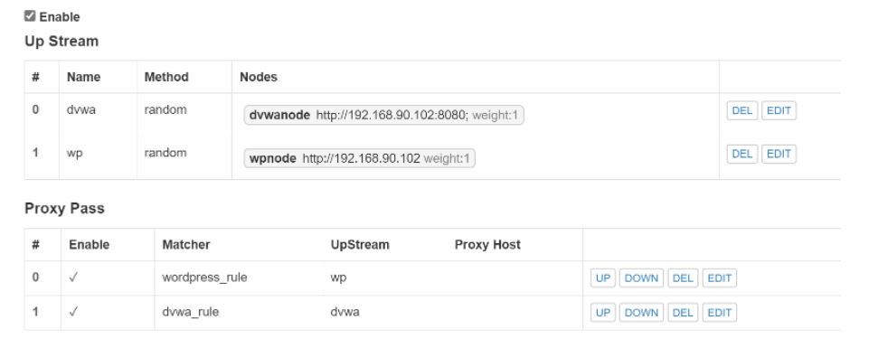

## H5

### 实验环境

- Ubuntu 20.04 Server
- Nginx
- VeryNginx
- wordpress

------


### 实验要求

**1、基本要求**

- 在一台主机（虚拟机）上同时配置Nginx和VeryNginx
- VeryNginx作为本次实验的Web App的反向代理服务器和WAF
- PHP-FPM进程的反向代理配置在nginx服务器上，VeryNginx服务器不直接配置Web站点服务
- 使用Wordpress搭建的站点对外提供访问的地址为： [http://wp.sec.cuc.edu.cn](http://wp.sec.cuc.edu.cn/)
- 使用Damn Vulnerable Web Application (DVWA)搭建的站点对外提供访问的地址为： [http://dvwa.sec.cuc.edu.cn](http://dvwa.sec.cuc.edu.cn/)

**2、安全加固要求**

- 使用IP地址方式均无法访问上述任意站点，并向访客展示自定义的友好错误提示信息页面-1
- Damn Vulnerable Web Application (DVWA)只允许白名单上的访客来源IP，其他来源的IP访问均向访客展示自定义的友好错误提示信息页面-2
- 在不升级Wordpress版本的情况下，通过定制VeryNginx的访问控制策略规则，热修复WordPress < 4.7.1 - Username Enumeration
- 通过配置VeryNginx的Filter规则实现对Damn Vulnerable Web Application (DVWA)的SQL注入实验在低安全等级条件下进行防护

**2、VeryNginx配置要求**

- VeryNginx的Web管理页面仅允许白名单上的访客来源IP，其他来源的IP访问均向访客展示自定义的友好错误提示信息页面-3
- 通过定制VeryNginx的访问控制策略规则实现：
  - 限制DVWA站点的单IP访问速率为每秒请求数 < 50
  - 限制Wordpress站点的单IP访问速率为每秒请求数 < 20
  - 超过访问频率限制的请求直接返回自定义错误提示信息页面-4
  - 禁止curl访问

------

### 实验过程

- **安装配置Verynginx、Nginx、Wordpress、DVWA**

#### Nginx

```bash
sudo apt update
sudo apt install nginx

# 安装mysql数据库和安全脚本
sudo apt install mysql-server
sudo mysql_secure_installation

# 安装php
sudo apt install php-fpm php-mysql
```

主机可成功访问


#### Verynginx

```bash
git clone https://github.com/alexazhou/VeryNginx.git
cd VeryNginx
sudo python3 install.py install


# 修改 `/opt/verynginx/openresty/nginx/conf/nginx.conf` 配置文件
sudo vim /opt/verynginx/openresty/nginx/conf/nginx.conf

#修改以下部分：

# 用户名
user  www-data;

# 监听端口
# 为了不和其他端口冲突，此处设置为8081
server {
        listen 192.168.153.129:9090;
        
        #this line shoud be include in every server block
        include /opt/verynginx/verynginx/nginx_conf/in_server_block.conf;

        location = / {
            root   html;
            index  index.html index.htm;
        }
    }
# 添加Nginx进程的权限
sudo chmod -R 777 /opt/verynginx/verynginx/configs
```


进入管理面板`http://192.168.153.128:8081/verynginx/index.html`


#### Wordpress

```bash
# 下载安装包
sudo wget https://wordpress.org/wordpress-4.7.zip

# 解压，unzip需要提前安装 
unzip wordpress-4.7.zip

# 将解压后的wordpress移到指定路径
sudo mkdir /var/www/html/wp.sec.cuc.edu.cn
sudo cp -r wordpress /var/www/html/wp.sec.cuc.edu.cn

# 下载安装mysql数据库
sudo apt install mysql-server
# 登录
sudo mysql

# 新建一个数据库wordpress
CREATE DATABASE wordpress DEFAULT CHARACTER SET utf8 COLLATE utf8_unicode_ci;

# 新建一个用户 刷新并退出
GRANT ALL ON wordpress.* TO 'wordpressuser'@'localhost' IDENTIFIED BY 'password';
FLUSH PRIVILEGES;
EXIT;

# 安装php拓展
sudo apt update
sudo apt install php-curl php-gd php-intl php-mbstring php-soap php-xml php-xmlrpc php-zip

# 重启php-fpm
sudo systemctl restart php7.4-fpm
```

使用`wp.sec.cuc.edu.cn/wordpress/wp-admin/`访问wordpress


#### DVWA

```bash
# 下载
git clone https://github.com/digininja/DVWA.git
# 建立目录
sudo mkdir /var/www/html/dvwa.sec.cuc.edu.cn
# 移动文件夹内容至该目录下
sudo mv DVWA/* /var/www/html/dvwa.sec.cuc.edu.cn

#配置数据库
sudo mysql
CREATE DATABASE dvwa DEFAULT CHARACTER SET utf8 COLLATE utf8_unicode_ci;
CREATE USER 'dvwa'@'localhost' IDENTIFIED BY 'A_jian123';
GRANT ALL ON dvwa.* TO 'dvwa'@'localhost';
exit

#配置php
sudo mv config.inc.php.dist config.inc.php

# 默认配置：
$_DVWA[ 'db_database' ] = 'dvwa';
$_DVWA[ 'db_user' ] = 'dvwa';
$_DVWA[ 'db_password' ] = 'p@ssw0rd';

# 修改php-fpm文件
sudo vim /etc/php/7.4/fpm/php.ini 

display_errors: Off
safe_mode: Off
allow_url_include: On
allow_url_fopen: On

#重启php
systemctl restart php7.4-fpm.service

#授权给www-data用户和组
sudo chown -R www-data.www-data /var/www/html/dvwa.sec.cuc.edu.cn
```

#### VeryNginx 配置反向代理

- 访问管理面板http://192.168.153.128:8081/verynginx/index.html，登录用户名和密码为 `verynginx` / `verynginx`
- 配置Matcher




#### 安全加固要求

1.使用IP地址方式均无法访问上述任意站点，并向访客展示自定义的友好错误提示信息页面-1

添加matcher


添加自定义response以及filter

结果：


2.[Damn Vulnerable Web Application (DVWA)](http://www.dvwa.co.uk/)只允许白名单上的访客来源IP，其他来源的IP访问均向访客展示自定义的友好错误提示信息页面-2

Matcher


Response


Filter


结果：


3.在不升级Wordpress版本的情况下，通过定制[VeryNginx](https://github.com/alexazhou/VeryNginx)的访问控制策略规则，热修复WordPress < 4.7.1 - Username Enumeration

Matcher


Fillter


结果：


4.通过配置[VeryNginx](https://github.com/alexazhou/VeryNginx)的Filter规则实现对[Damn Vulnerable Web Application (DVWA)](http://www.dvwa.co.uk/)的SQL注入实验在低安全等级条件下进行防护

Matcher


Fillter


结果：


5.[VeryNginx](https://github.com/alexazhou/VeryNginx)的Web管理页面仅允许白名单上的访客来源IP，其他来源的IP访问均向访客展示自定义的**友好错误提示信息页面-3**

Matcher


Filter


结果：


6.通过定制VeryNginx的访问控制策略规则实现以下

- 限制DVWA站点的单IP访问速率为每秒请求数 < 50
- 限制Wordpress站点的单IP访问速率为每秒请求数 < 20
- 超过访问频率限制的请求直接返回自定义**错误提示信息页面-4**


结果：


- 禁止curl访问


结果：


### 问题及解决

- 执行`sudo python3 install.py install`时报错，经查[Trouble Shooting](https://github.com/alexazhou/VeryNginx/wiki/Trouble-Shooting)后安装必要的库后问题解决。

### 参考资料

[DVWA.GIT](https://github.com/digininja/DVWA/blob/master/README.zh.md)

[verynginx](https://github.com/alexazhou/VeryNginx/blob/master/readme_zh.md)
